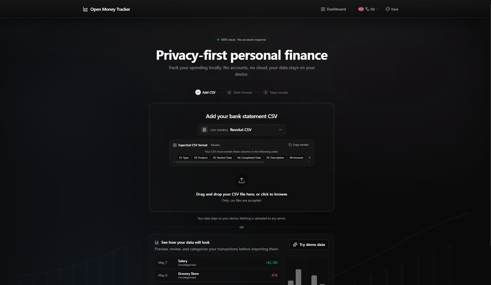
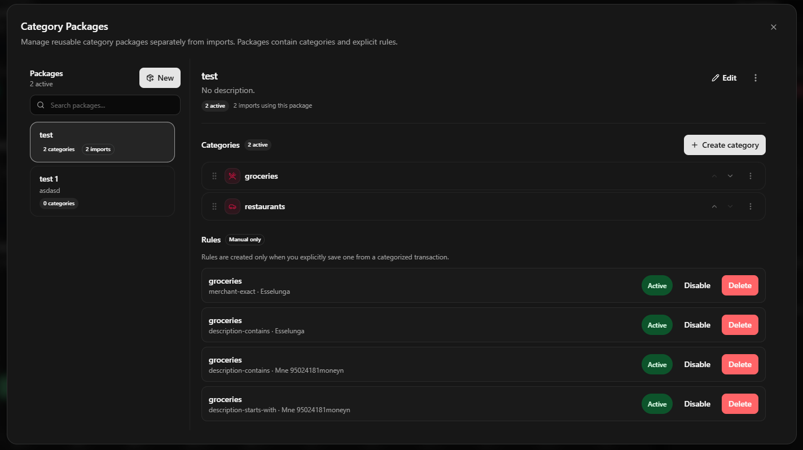
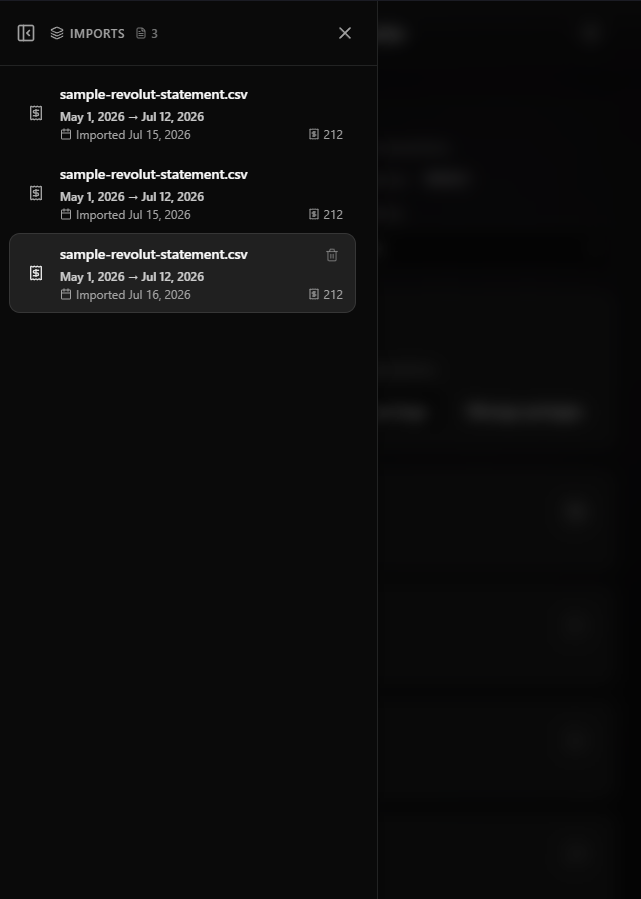
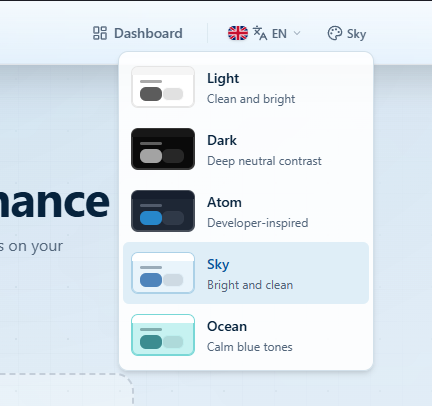

# Open Money Tracker

Privacy-first, local-only personal finance tracker. Import your bank CSV exports and get instant financial analysis — entirely in your browser. No accounts, no cloud, no data leaves your device.



## Features

| Feature                       | Description                                                                                        |
| ----------------------------- | -------------------------------------------------------------------------------------------------- |
| **100% Local**                | All processing in the browser. CSV parsed client-side. Data stored in IndexedDB. Nothing uploaded. |
| **CSV Import**                | Drag-and-drop or file picker. Supports Revolut format with automatic column detection.             |
| **Category Packages**         | Create reusable category systems. Fully user-defined — no preset categories.                       |
| **Auto-categorization Rules** | Create rules from transactions: exact merchant, description match, contains, or starts-with.       |
| **Financial Dashboard**       | Cash flow chart, spending by category, income/expenses, balance, and transaction filters.          |
| **Multi-currency**            | Supports any currency (no conversion).                                                             |
| **Themes**                    | Dark, Light, Atom, Sky, Ocean — all with full dark/light compatibility.                            |
| **i18n**                      | English and Spanish.                                                                               |
| **Responsive**                | Desktop sidebar with push layout, mobile drawer overlay.                                           |
| **Keyboard & A11y**           | Full keyboard navigation, reduced motion, screen reader support.                                   |

## Tech Stack

| Layer       | Technology                                   |
| ----------- | -------------------------------------------- |
| Framework   | [Astro](https://astro.build) (static output) |
| UI          | React islands, shadcn/ui primitives          |
| Styling     | Tailwind CSS v4, CSS custom properties       |
| State       | Zustand (React stores) + localStorage        |
| Storage     | IndexedDB via `idb`                          |
| Charts      | Recharts                                     |
| CSV Parsing | Papa Parse                                   |
| Icons       | Lucide React                                 |
| Languages   | TypeScript                                   |

## Architecture

```
src/
├── core/               App config, i18n, routing, types
├── shared/             Reusable UI primitives, hooks, utilities
├── modules/
│   ├── landing/        Landing/marketing page
│   ├── navigation/     Navbar, theme/locale providers, drawers
│   ├── import-transactions/  CSV parsing, validation, storage
│   ├── dashboard/      Financial dashboard, charts, table
│   └── categories/     Category packages, rules, assignments
└── styles/             Global CSS, theme tokens, base styles
```

### Module Overview

| Module                | Responsibility                                                                               |
| --------------------- | -------------------------------------------------------------------------------------------- |
| `core`                | App configuration, internationalisation, route constants                                     |
| `shared`              | shadcn/ui components, formatting utilities, class merging                                    |
| `landing`             | Marketing hero, feature highlights, footer                                                   |
| `navigation`          | Navbar, theme/locale providers, mobile drawer, desktop sidebar toggle                        |
| `import-transactions` | CSV parsing, date validation, IndexedDB persistence                                          |
| `dashboard`           | Metrics, charts, transaction table, filters, pagination, excluded transactions               |
| `categories`          | User-defined category packages, categories with icons/colors, rules, transaction assignments |

## Getting Started

```bash
# Install dependencies
npm install

# Start dev server
npm run dev

# Type-check
npx astro check

# Production build
npm run build

# Preview production build
npm run preview
```

The dev server runs at `http://localhost:4321` (check terminal output for actual port).

## CSV Import Guide

### Supported Format

Revolut CSV export with these columns (order-independent):

`Type, Product, Started Date, Completed Date, Description, Amount, Fee, Currency, State, Balance`

### Steps

1. **Upload** — Drag and drop your CSV file or click to browse.
2. **Select provider** — Choose the bank that exported the file.
3. **Verify date format** — Confirm the detected date format matches your file.
4. **View results** — Parsing, normalisation, and persistence happen automatically.
5. **Dashboard** — You are redirected to the dashboard with the new import selected.

## Dashboard Guide

### Layout

- **Left sidebar** — Lists all imports. Click to select, hover to delete. Collapsible via navbar toggle.
- **Main area** — Header with import metadata, currency/date filters.
- **Metrics** — Current Balance, Total Income, Total Expenses, Net Cash Flow.
- **Charts** — Cash Flow Over Time (composed bar + line), Spending by Category (bar list).
- **Insights** — Highest spending category, largest expense, average daily spending, most frequent merchant.
- **Transactions table** — Search, filter by category/type/date, sort, paginate. Include/exclude checkboxes. Inline category editing with "Create rule" action.

### Category Packages



1. Click **Manage packages** in the Category Package selector.
2. Create a **New package** and give it a name.
3. Add categories with custom names, icons, and colors.
4. Drag to reorder categories, or use the arrow buttons.
5. Click the icon to open the icon picker.

### Auto-categorization Rules

1. Select a category package for your import.
2. In the transactions table, categorise a transaction.
3. Click **Create rule** and choose a match type:
   - **Exact merchant match** — Same merchant name in future imports.
   - **Exact description** — Exact transaction description.
   - **Description contains** — Description contains a keyword.
   - **Description starts with** — Description starts with a keyword.
4. Rules are package-scoped and apply only when that package is selected.

### Excluding Transactions

Uncheck the checkbox at the start of any transaction row to exclude it from all calculations (metrics, charts, insights). Excluded transactions remain visible in the table (dimmed) and can be re-included at any time.

## Import Flow Diagram

```
CSV File ──► Papa Parse ──► Validation ──► Normalisation ──► IndexedDB
                │                │                │
           Date format      Rejected rows    NormalizedTransaction
           detection        + warnings       + ImportRecord
```



## Configuration

### Locale

Switch between English and Spanish via the language icon in the navbar. Locale is persisted and triggers a page reload to re-render all translated content.

## Themes

Open Money Tracker includes **6 visual themes** to suit your preference. Switch between them at any time via the palette icon in the navbar — no reload needed.

| Theme     | Style                                                  | Preview |
| --------- | ------------------------------------------------------ | ------- |
| **Dark**  | Deep black background, high contrast, easy on the eyes | Default |
| **Light** | Clean white background, crisp and professional         |         |
| **Atom**  | Midnight blue with cyan accents, developer-inspired    |         |
| **Sky**   | Bright blue tones, airy and open                       |         |
| **Ocean** | Calm teal blues, relaxing and balanced                 |         |
| **Pink**  | Blush rose palette, warm and elegant                   | New     |

Theme preference is persisted in `localStorage` and restored on each visit. All themes are fully compatible with every component, chart, and section of the application.



## Build Output

The project generates a fully static site in `dist/`. No server required. Deploy to any static host (Vercel, Netlify, GitHub Pages, Cloudflare Pages, etc.).

## Development

```bash
# Commands
npm run dev          # Start dev server
npm run build        # Production build
npm run preview      # Preview production build
npx astro check      # TypeScript check
npx astro --help     # Astro CLI help
```

## License

MIT

## PWA Support

Open Money Tracker is a Progressive Web App. When opened in a supported browser (Chrome, Edge, Safari), you can install it to your device for an app-like experience:

- **Install prompt** — The browser will show an install prompt after a few visits.
- **Offline access** — Core assets are cached via service worker. Once loaded, the app works without an internet connection.
- **Full-screen mode** — Runs without browser chrome when installed, like a native app.
- **Auto-updates** — The service worker checks for updates on each visit and applies them seamlessly.

## Sitemap

A `sitemap-index.xml` is automatically generated at build time, listing all public pages (`/`, `/dashboard`). This helps search engines index the site correctly.

## Built with AI

This project was developed with the assistance of [OpenCode](https://opencode.ai), an interactive CLI tool for software engineering tasks. The AI models used throughout development include:

| Model             | Role                                                                                    |
| ----------------- | --------------------------------------------------------------------------------------- |
| DeepSeek V4 Flash | Primary coding agent — architecture, components, state management, styling, refactoring |
| GPT 5.5           | Code review, UX suggestions, translation support                                        |
| MiniMax M3        | Alternative reasoning, edge-case analysis, file organisation                            |

All code was reviewed and tested before commit. The AI acted as an engineering assistant — architecture decisions, data modelling, and final validation were human-led.

> **Note:** The project includes `AGENTS.md` and `CLAUDE.md` configuration files, but these were **not** used during development. The workflow relied exclusively on OpenCode's native session management and direct prompt engineering.
